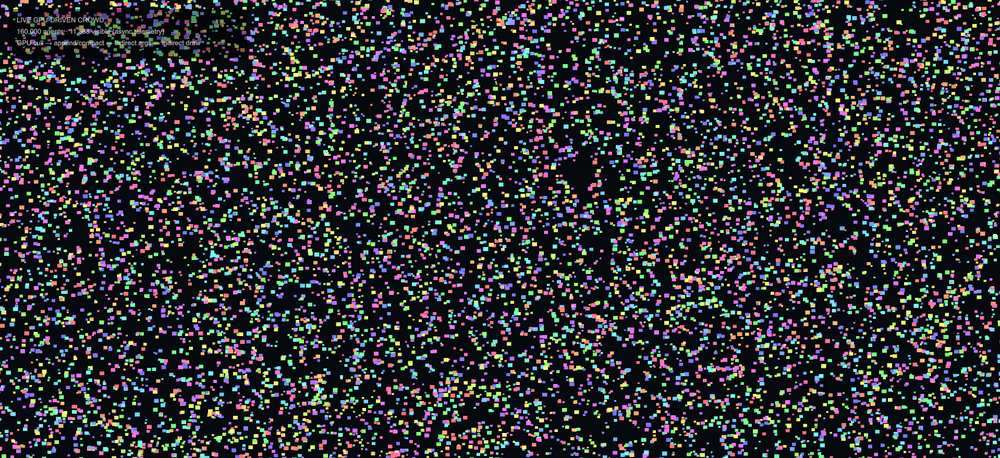

# HLSL Kernel Pipeline

**GPU performance engineering in HLSL/D3D12: optimize complete operations, validate them, compare against mature baselines, and know when to stop.**

This repository is an engine-neutral GPU performance lab and reusable D3D12 primitive SDK. It contains scan, compaction, histogram/prefix, radix-sort, reduction and transpose research workloads; explicit integrations of mature external implementations; correctness gates; paired benchmark tooling; and application-level GPU/CPU comparisons.

The main engineering question is not “can this shader benchmark faster?” It is **whether a change improves the complete operation or caller under a fixed contract, with enough evidence to justify using it.**

## Flagship performance cases

### 1. GPU optimization that paid off — RTX 4090 inclusive scan

A separate full-array conversion pass was removed by producing inclusive values while the scan input vector was already loaded.

| Implementation | Complete GPU operation | Relative result |
| --- | ---: | ---: |
| Original exclusive scan + AddInput conversion | 6.376 ms | baseline |
| **Native-inclusive fused path** | **2.904 ms** | **54.45% less time** |
| Pinned GPUPrefixSums RTS | 3.584 ms | fused used **18.97% less time** |

Workload: `2^28` uint32 elements on an RTX 4090. Six balanced rounds covered all three-arm order permutations in **18 fresh processes**, with 100 timed iterations per process and full correctness gates.

At this size, the removed conversion stage logically read input and output and rewrote output: **3 GiB of full-array traffic**. That source-level accounting is not presented as measured DRAM bytes. A later Nsight Graphics capture independently showed the old `AddInput` shader stage present in `tile` and absent in `tile-fused`; whole-capture DRAM activity fell from **71.04% to 58.55%**, with the read-side signal falling from **35.59% to 19.64%**, while occupancy/register-pressure signals did not improve. Because that trace spans multiple submits and contains background graphics activity, these counters are treated as **directional mechanism evidence**, not scan-isolated byte attribution.

[Timing/correctness report](docs/results/RTX4090_INCLUSIVE_SCAN_2026-09-15.md) · [Hardware-profile diagnosis](docs/results/RTX4090_INCLUSIVE_SCAN_PROFILE_DIAGNOSIS.md) · [Capture evidence](docs/evidence/rtx4090-scan-nsight-20260917/README.md) · [API and reproduction](docs/integration/SCAN_INCLUSIVE.md)

**Engineering takeaway:** remove whole-operation work first, then use hardware counters to test the mechanism. Keep the counter claim scoped to the range actually captured.

### 2. GPU optimization that did not pay off — complete Crowd/VFX caller

Primitive-level scan improvements did not survive the complete application contract. The benchmark compares four GPU paths, including pinned GPUPrefixSums RTS, against conventional CPU rendering for the same deterministic 8,388,608-agent Crowd/VFX task.

| Implementation | Lifecycle cost / request | Reused request mean |
| --- | ---: | ---: |
| Fused GPU | 45.12 ms | 6.08 ms |
| **Wave-tiled GPU** | **48.04 ms** | **7.56 ms** |
| External GPUPrefixSums RTS | 48.85 ms | 6.90 ms |
| CPU, 1 worker | 11.87 ms | 8.11 ms |
| **CPU, 12 workers** | **6.98 ms** | **3.04 ms** |

The lifecycle metric charges first-use preparation, 12 complete requests, upload/render/readback/export and cleanup. Across **81 fresh processes** in nine balanced orders, all **972 complete atlas checks passed**. Wave-tiled versus RTS did not establish a win; CPU12 was 6.88x lower complete lifecycle cost than wave-tiled for this caller.

The run also retained an uncomfortable result instead of filtering it away: desktop GPU background snapshots ranged from 0–34%, and only 35/81 processes passed both strict quiet brackets. All samples were retained and the limitation is part of the conclusion.

[PR #4 — complete Crowd/VFX benchmark](https://github.com/Yanagisawa2002/hlsl-kernel-pipeline/pull/4)

**Engineering takeaway:** a faster primitive is not automatically a faster product path. For this CPU-input / buffered-export contract, the decision is to stop further scan tuning and use the CPU path unless the caller changes materially, such as becoming GPU-resident.

### GPU-resident follow-up — architecture validated on hardware

The primitive optimization paid off, but the complete CPU-output caller still favored CPU12. Rather than tune the scan further under that losing contract, the follow-up changed the workload boundary and built a separate GPU-resident Unity path.

The GPU-resident follow-up was hardware-validated in Unity at **160k and 1M total agents**. A RenderDoc capture confirmed compute culling → GPU append/compact → `CopyStructureCount` into indirect arguments → `DrawInstancedIndirect`, with the draw consuming the GPU-produced visible-ID buffer. The render path therefore does not require a CPU visibility list or CPU instance-count decision; asynchronous readback supplies telemetry only.

**This is architecture evidence, not a CPU-vs-GPU performance claim.** The earlier complete-task CPU12 result is unchanged; total agent counts do not imply that all agents are simultaneously visible.

[Hardware validation report](docs/results/LIVE_GPU_DRIVEN_VALIDATION_2026-09-17.md) · [Evidence package](docs/evidence/live-gpu-crowd-20260917/README.md) · [Unity live sample](unity/LiveGpuDrivenCrowd/README.md)

<details>
<summary>Hardware evidence: Unity view and captured GPU command chain</summary>

Unity at 160,000 total agents; the overlay reports the visible subset via asynchronous telemetry.



A separate captured frame shows `CullAgents`, `CopyStructureCount` and an indirect draw of 11,429 instances.


</details>

## What this project demonstrates

- **Whole-operation measurement.** Timings include the GPU work required by the operation rather than presenting an isolated kernel dispatch as the final answer.
- **External baselines.** Pinned GPUPrefixSums RTS, AMD/FidelityFX-derived paths and native research baselines are compared explicitly; results where mature libraries win are retained.
- **Correctness before speed.** Full-output validation, poison/reconstruction checks, deterministic CPU oracles and source/binary/runtime identity are used as gates around timing evidence.
- **Noise-aware experiments.** Balanced run order, fresh processes, drift/background checks and paired intervals are used where the measurement question justifies them.
- **Profiler-driven diagnosis.** Static RGA evidence is kept separate from runtime counters. The RTX 4090 scan case now includes captured Nsight Graphics memory/SM/occupancy/stall signals with explicit scope limits instead of post-hoc claims about exact DRAM bytes or occupancy.
- **Stop decisions.** The repository records both successful optimization and negative complete-task results. A narrow benchmark win is not treated as a deployment recommendation.

## SDK and architecture

Applications own resources, queues, submission and synchronization. The library provides explicit operation plans and backend selection rather than hiding those boundaries.

```text
application input + explicit implementation + runtime identity
                           |
                           v
             PrimitiveOperations / Select
              complete operation + fallback
                           |
                           v
          application buffers + PSOs + state map
         t0/t1 + u0..u4 + b0[8] + ordered passes
                           |
                           v
                D3D12OperationRecorder
             copies / dispatches / barriers
                           |
                           v
         application queue / fence / output consumer
```

The public SDK can explicitly reuse pinned GPUPrefixSums RTS and AMD Parallel Sort where compatible, while internal algorithms remain research candidates unless evidence supports a specific deployment profile. The application owns the final choice.

[SDK guide](docs/SDK.md) · [ABI contract](docs/ABI.md) · [methodology](docs/METHODOLOGY.md) · [provenance](docs/PROVENANCE.md)

## Research workloads

The current workload pack is intentionally broad enough; the project is not trying to maximize primitive count.

- `reduction-u32-v1` — recursive uint reduction.
- `exclusive-scan-u32-v1` — hierarchical, wave-hybrid and persistent decoupled-look-back variants.
- `generic-exclusive-scan-u32-v1` — add/min/max/XOR and Wave32/64 axes.
- `segmented-exclusive-scan-u32-v1` — pair-monoid segmented look-back scan.
- `stream-compaction-u32-v1` — unfused scan/scatter versus fused producer-consumer.
- `histogram-prefix-u32-v1` — global atomics versus replicated LDS plus offsets.
- `radix-sort-u32-v1` — stable 32-bit binary LSD sort using reusable scan scratch.
- `transpose-u32-v1` — padded groupshared 2D tiles.

The standalone GPU-driven Crowd/VFX demo adds an application-shaped path: visibility classification → stable compaction → tile histogram/prefix → tile-seed scatter → deterministic tiled compute rasterization → full atlas validation.

[GPU-driven demo](gpu-driven-demo/README.md) · [experiment history](docs/EXPERIMENT_HISTORY.md)

## Additional measured evidence

The two cases above are the portfolio entry points. The repository keeps the broader history for auditability rather than presenting every result as equally important.

- **Radeon AI PRO R9700, September 9:** all 70 preregistered processes and independent GPU correctness gates passed. Tiled 4-bit sort measured 12.124 ms versus a GPUSorting FFX baseline at 15.038 ms on its exact `2^25` pair workload; the other six external comparisons favored RTS, DeviceRadixSort, OneSweep or FFX over the tested candidate. [Native confirmation report](docs/results/R9700_NATIVE_CONFIRMATION_2026-09-09.md).
- **R9700, September 7:** the internal single-pass scan showed a 1.4782x–1.5254x gain over its declared in-repository baseline at 16,777,216 elements, while separate external comparisons showed the internal scan and sort losing to mature libraries. [vNext integration report](docs/results/R9700_VNEXT_INTEGRATION_2026-09-07.md) · [external comparison](docs/integration/UNIFIED_BENCHMARK_RESULTS.md).

These results are workload- and machine-specific. They are not automatic backend promotions.

## Profiling policy

Timing answers **whether** an operation changed. Profiling should answer **why**.

For runtime diagnosis, capture the same validated workload and compare evidence such as:

- operation/range duration and dispatch structure;
- DRAM and L2 activity;
- SM throughput and achieved occupancy;
- register/shared-memory occupancy limits;
- dominant warp stalls;
- barriers, queue gaps and synchronization;
- overlapping work from other processes.

Static compiler/ISA evidence is useful but is not substituted for runtime counters. The current RGA integration therefore keeps occupancy fields nullable when the tool output cannot establish them. Runtime counter claims are likewise scoped to the exact trace range actually captured.

[RGA evidence policy](docs/RGA.md) · [RTX 4090 runtime-counter diagnosis](docs/results/RTX4090_INCLUSIVE_SCAN_PROFILE_DIAGNOSIS.md)

## My contribution

I implemented the primitive adapters and execution ABI, D3D12 executor and borrowed-resource recorder, paired calibration/confirmation tooling, source-aware caching, profile validation for Unity, application benchmark harnesses and internal research kernels. External RTS/AMD shader algorithms retain their upstream attribution; DXC, Vortice, RGA and profiler tools are external dependencies/tooling rather than reimplemented components.

## Quick start

Install the .NET SDK **10.0.302** pinned by `global.json` for the CPU-side plan/example and native live-demo paths. Actual D3D12 recording and GPU evaluation require a supported Windows GPU.

```powershell
dotnet restore examples/HlslPerf.PrimitiveApp/HlslPerf.PrimitiveApp.csproj --configfile examples/HlslPerf.PrimitiveApp/NuGet.offline.config -p:NuGetAudit=false
dotnet build examples/HlslPerf.PrimitiveApp/HlslPerf.PrimitiveApp.csproj -c Release --no-restore
dotnet run --project examples/HlslPerf.PrimitiveApp -c Release --no-build --no-restore -- . --check
```

Native D3D12 live preview (Windows GPU):

```powershell
dotnet run --project src/HlslPerf.GpuDrivenLiveDemo -- --arm fused --agents 1048576
```

For GPU-resident indirect rendering, follow the [Unity live sample setup](unity/LiveGpuDrivenCrowd/README.md). The native preview reads back its output for presentation; the Unity sample keeps the render path GPU-resident.

Optional GPU evaluation examples:

```powershell
dotnet build src/HlslPerf.Cli/HlslPerf.Cli.csproj -c Release
dotnet run --project src/HlslPerf.Cli -c Release --no-build -- tune manifests/scan.json
dotnet run --project src/HlslPerf.GpuDrivenDemo -c Release -- validate
dotnet run --project src/HlslPerf.GpuDrivenDemo -c Release --no-build -- run --level all --budget-ms 8.333333
```

RGA is optional and never redistributed:

```powershell
dotnet run --project src/HlslPerf.Cli -c Release --no-build -- tune manifests/scan.json --rga C:/tools/rga/rga.exe --rga-target gfx1201
```

GPU timing is never cached. Compilation cache identity includes source/compiler/options/entry point/defines, and profile compatibility includes device, driver, backend, shader model, compiler, manifest hash and transitive kernel hash.

[Replay commands](docs/integration/REPLAY.md) · [inclusive scan reproduction](docs/integration/SCAN_INCLUSIVE.md) · [Unity adapter](docs/UNITY_ADAPTER.md)

## Scope and provenance

This is an independent personal implementation. Employer/client source, assets and configuration are not required by the benchmark or tuner. External algorithms and tooling retain their upstream licenses and provenance.

The [limited benchmark reproduction permission](LICENSE.md#limited-benchmark-reproduction-permission) permits benchmark reproduction and publication of measurement results; it is not a general open-source license.