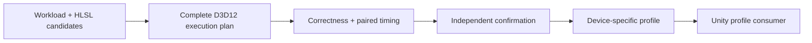
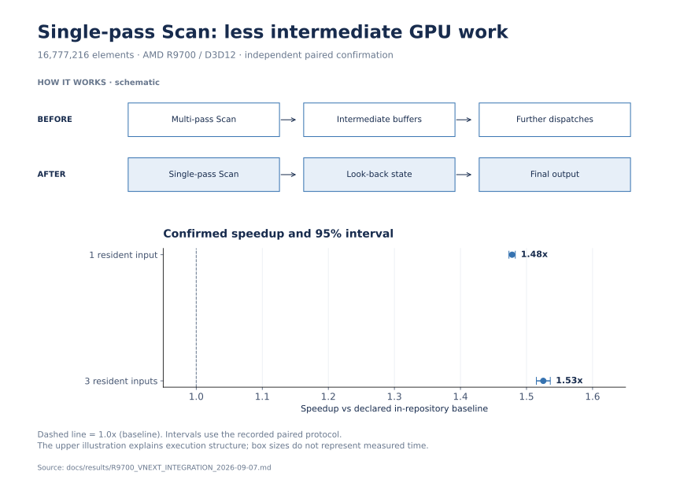

# HLSL Kernel Pipeline

**Build, validate and tune GPU execution plans that an application can reuse.**

A faster kernel is useful only when it produces the right output and improves
the complete operation. I built an engine-neutral HLSL/D3D12 SDK that connects
algorithm implementations, device measurements and deployable profile formats.

## Results

**September 8 repair: new algorithms and external SDK paths are Unmeasured.**
The [wave-tiled scan/compaction](docs/integration/SCAN_WAVE_TILED.md) and tiled
stable radix candidates remain explicit opt-ins. The SDK exposes pinned
GPUPrefixSums RTS / AMD Parallel Sort operations with identity checks and fallback.
[Native external benchmark adapters](benchmarks/external/README.md) preserve
upstream workloads; this repair uses compilation and CPU checks only.

- **1.4782x–1.5254x confirmed single-pass Scan speedup** at 16,777,216 elements,
  with one or three resident inputs, against the declared in-repository baseline.
- **19,584 output/poison checks passed** across the recorded 18-run formal matrix.

These are AMD Radeon AI PRO R9700 / D3D12 results from the September 7 paired
measurement protocol. [Exact controls and confidence intervals](docs/results/R9700_VNEXT_INTEGRATION_2026-09-07.md).

The separate historical external comparison found the internal single-pass
Scan took **2.21124× RTS time at 8 Mi elements**, and internal eight-bit sorting
took **2.41331× AMD Parallel Sort time at 1 Mi key/value pairs**. These ratios
favor the external libraries and belong to source
`824cfafc9a07ade0a3cf440c1f5b3a19af2e8bf0`; they do not measure this repair.
[Controls, failed/inconclusive cells and source identity](docs/integration/UNIFIED_BENCHMARK_RESULTS.md).



## Visual walkthrough

[](docs/portfolio/overview.png)

Single-pass execution schematic with the two independently confirmed Scan results and their 95% intervals. [Sources and reproduction](docs/portfolio/README.md).

## Engineering challenges

1. **Optimize the whole operation.** Scan, compaction and stable radix sorting
   need buffer management, barriers, scratch storage and output verification
   around the shader dispatches.
2. **Separate speedup from measurement noise.** Device state, input reuse and
   run order affect timings; selection needs fresh confirmation and drift checks.

## My contribution

I implemented HLSL primitives, the workload-plugin/execution ABI, the D3D12
executor, paired calibration and confirmation, source-aware caching, and profile
validation for Unity. DXC, Vortice and optional AMD RGA provide the compiler,
API binding and static shader analysis used by the system.

## Evidence and reproduction

[Latest results](docs/results/R9700_VNEXT_INTEGRATION_2026-09-07.md) ·
[Replay commands](docs/integration/REPLAY.md) · [SDK](docs/SDK.md) ·
[Visual showcases and experiment history](docs/EXPERIMENT_HISTORY.md) ·
[Quick start](#quick-start).

## Architecture and ownership boundary

    manifest v3 + workload provider/plugin + HLSL/include graph
                    |
                    v
          engine-neutral execution plan
       buffers + t0/t1/u0/u1 + b0[8] + passes
                    |
                    v
           generic D3D12 plan executor
       upload -> dispatch/barriers -> timestamps
                    |
          +---------+----------------+
          |                          |
          v                          v
      CPU oracle              optional RGA adapter
      SHA-256 gate      VGPR/SGPR/LDS/scratch/live VGPR
          |                          |
          +-------------+------------+
                        v
          run.json + CSV + HTML/SVG/GIF
                        |
                        v
              selected profile.json
                        |
                        v
      independent Unity UPM consumer (read-only)

The core and workload pack reference no Unity assemblies. The package under
`unity/com.edwinliu.hlslperf-profile` only validates and resolves an emitted
profile. Project code owns the final mapping from integer defines to its shader
variant system through `IHlslPerfDefineSink`.

## Real workload pack

- `reduction-u32-v1`: recursively reduces all input elements to one uint.
- `exclusive-scan-u32-v1`: compares hierarchical Blelloch, wave-hybrid, and
  persistent decoupled-look-back single-pass backends.
- `generic-exclusive-scan-u32-v1`: add/min/max/XOR with Wave32/64 and vector axes.
- `segmented-exclusive-scan-u32-v1`: pair-monoid segmented look-back scan.
- `stream-compaction-u32-v1`: unfused scan/scatter versus fused producer-consumer.
- `histogram-prefix-u32-v1`: global atomics versus replicated LDS plus offsets.
- `radix-sort-u32-v1`: stable 32-bit binary LSD sort using reusable scan scratch.
- `transpose-u32-v1`: padded groupshared 2D tiles with tunable tile dimension
  and block-row count.

Each provider builds the same public `KernelExecutionPlan` ABI, so a future
external workload package can supply buffers, constants, passes, dispatch
dimensions, and an oracle without changing the D3D12 backend.

## Quick start

Requirements: Windows 10/11, a D3D12-capable GPU, and .NET 10 SDK.

Use a short Windows checkout path and `git -c core.longpaths=true clone`.
The safe first-use path performs CPU validation and compilation only:

```powershell
python tools/check_source_checkout.py
python tools/verify_external_sources.py
dotnet build HlslKernelPipeline.slnx -c Release
dotnet test tests/HlslPerf.Core.Tests/HlslPerf.Core.Tests.csproj -c Release --no-build
dotnet run --project tools/HlslPerf.CompileOnly -c Release -- . .scratch/sdk-compile
```

The commands above are separate from GPU execution. Tuning, diagnostics and the
historical commands below remain explicit runnable product features; they were
not run for this repair and are excluded from CPU CI. See
[external build/run entry points](benchmarks/external/README.md).
DynamicSmoke and GPU correctness runners are not CPU-only checks.

    dotnet build HlslKernelPipeline.slnx -c Release
    dotnet run --project src/HlslPerf.Cli -c Release --no-build -- tune manifests/reduction.json
    dotnet run --project src/HlslPerf.Cli -c Release --no-build -- tune manifests/scan.json
    dotnet run --project src/HlslPerf.Cli -c Release --no-build -- tune manifests/scan-single-pass.json
    dotnet run --project src/HlslPerf.Cli -c Release --no-build -- tune manifests/scan-generic.json
    dotnet run --project src/HlslPerf.Cli -c Release --no-build -- tune manifests/segmented-scan.json
    dotnet run --project src/HlslPerf.Cli -c Release --no-build -- tune manifests/compaction.json
    dotnet run --project src/HlslPerf.Cli -c Release --no-build -- tune manifests/histogram-prefix.json
    dotnet run --project src/HlslPerf.Cli -c Release --no-build -- tune manifests/radix-sort.json
    dotnet run --project src/HlslPerf.Cli -c Release --no-build -- tune manifests/transpose.json
    dotnet run --project src/HlslPerf.Showcase -c Release --no-build
    dotnet run --project src/HlslPerf.Showcase -c Release --no-build -- --stress-grid --budget-ms 8.333333
    dotnet run --project src/HlslPerf.GpuDrivenDemo -c Release --no-build -- validate

The Crowd/VFX GPU matrix is intentionally a separate explicit action:

    dotnet run --project src/HlslPerf.GpuDrivenDemo -c Release --no-build -- run --level all --budget-ms 8.333333

RGA is optional and never redistributed. If its CLI is installed or unpacked,
attach live-driver evidence with:

    dotnet run --project src/HlslPerf.Cli -c Release --no-build -- tune manifests/scan.json --rga C:/tools/rga/rga.exe --rga-target gfx1201

Use `--rga off` to disable auto-discovery. Without RGA, correctness, timing,
selection, and profile emission still work.

Outputs go to `.hlslperf/runs/<timestamp>/`. GPU timing is never cached; only
DXIL compilation is cached by source/compiler/options/entry-point/define
identity. The profile compatibility key includes device, driver, backend,
shader model, compiler, manifest hash, and transitive kernel hash. After timing,
the runner poisons the verified resource and requires one already-used plan
invocation to reconstruct every byte before a profile can be emitted.

The standalone showcase under `showcase/` references the public execution ABI
and D3D12 backend, not Unity. Unity remains a read-only profile consumer.

<details>
<summary>Evaluation details, tradeoffs and supported scope</summary>

## Latest confirmed result and limits

The [September 7 vNext integration report](docs/results/R9700_VNEXT_INTEGRATION_2026-09-07.md)
retained all 18 runs and passed 19,584 output/poison checks. At 16M elements,
single-pass scan confirmed **1.4782x** and **1.5254x** speedups for one and three
resident slots. Wide-radix and dynamic-plan results did not establish deployable
gains, and no runtime defaults were promoted.

These are bounded AMD Radeon AI PRO R9700 / D3D12 measurements under the report's
declared controls, not universal gains or wins over every external library.
The separate [external comparison](docs/integration/UNIFIED_BENCHMARK_RESULTS.md)
retains inconclusive and semantically incompatible comparisons as well as wins.

The [dynamic ABI v2 demo](docs/DYNAMIC_EXECUTION.md) adds bounded GPU-count indirect dispatch and independent multi-output verification. Its correctness evidence is separate from historical performance results.

## Deliberate non-goals

- No Unity project or employer repository is required by the tuner.
- No replacement compiler, GPU API binding, ISA analyzer, or generic search
  framework is implemented here; DXC, Vortice, and optional RGA are reused.
- RGA static resource data does not replace measured GPU timestamps.
- Current RGA DX12 text output does not provide total theoretical occupancy.
  The profile keeps that field nullable instead of fabricating it from VGPRs;
  full occupancy evidence belongs to an RGP/runtime-counter adapter.
- Exhaustive enumeration is intentional for small candidate spaces. A search
  strategy adapter becomes useful only when a real workload exceeds that scale.

Read the [ABI contract](docs/ABI.md), [measurement methodology](docs/METHODOLOGY.md),
[RGA evidence policy](docs/RGA.md), [Unity consumer boundary](docs/UNITY_ADAPTER.md),
[SDK guide](docs/SDK.md), [roadmap](docs/ROADMAP.md), and
[clean-room provenance](docs/PROVENANCE.md).

</details>

## Provenance and license

Independent personal implementation; see [provenance](docs/PROVENANCE.md) for the source boundary.

## Benchmark reproduction permission

The [limited benchmark reproduction permission](LICENSE.md#limited-benchmark-reproduction-permission)
allows anyone to run the benchmarks and required project components, make local
changes needed for reproduction, and publish measurement results. Other plugin
rights remain reserved; this is not an MIT or general open-source license.
