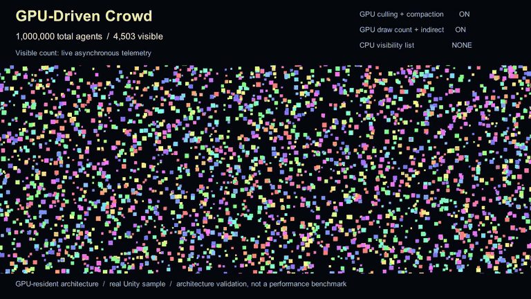
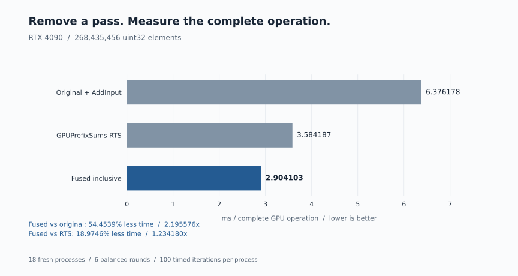
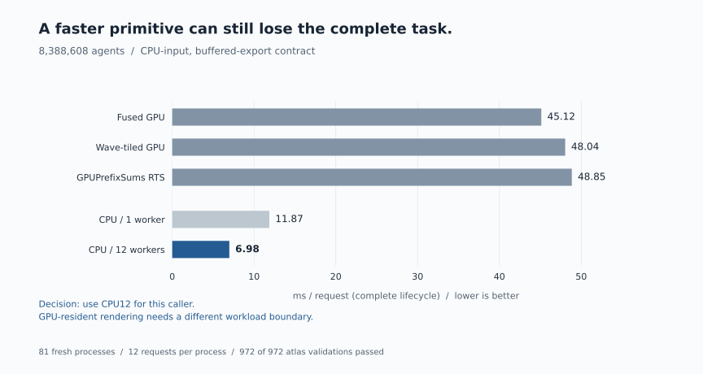
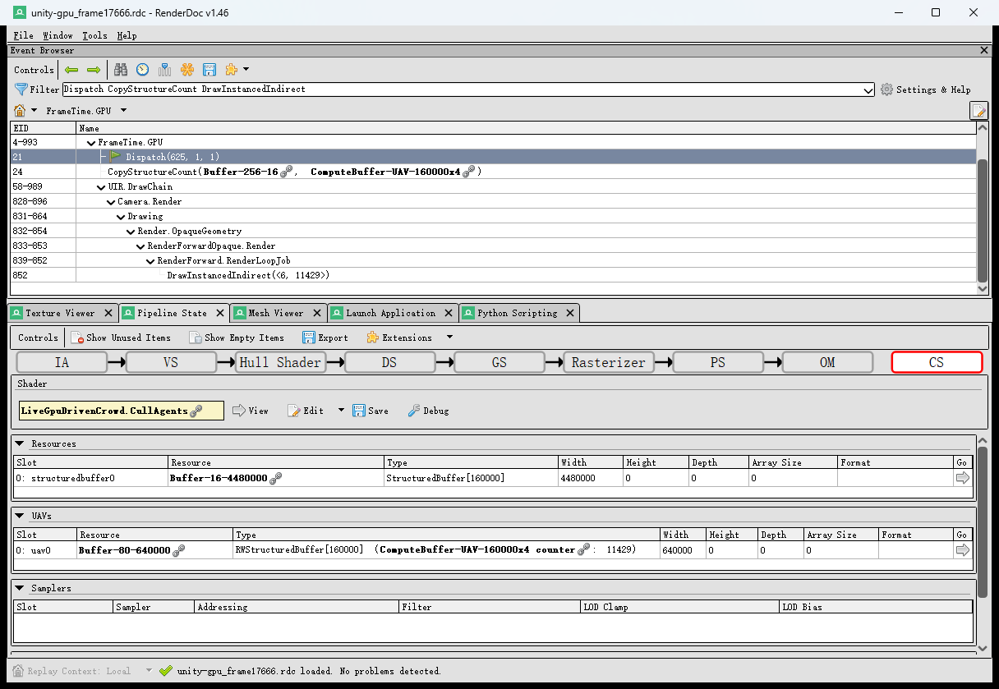

# HLSL Kernel Pipeline

GPU performance engineering from shader kernels to complete application architecture: optimize complete operations, validate correctness, profile the mechanism, and know when the GPU is the wrong answer.



**1,000,000 total-agent Unity sample:** GPU culling → append/compact visible IDs → GPU-written indirect args → indirect rendering. Only the visible subset is drawn.

**Architecture validation — not a CPU-vs-GPU performance claim.** [Higher-quality clip](docs/media/gpu-driven-crowd-hero.mp4) · [Capture provenance and limits](docs/media/README.md)

## Three performance-engineering cases

### 1. Optimization paid off



**6.376 ms → 2.904 ms: 54.45% less complete-operation time, or 2.20x.** The GPUPrefixSums-derived local adaptation produces inclusive values directly, eliminating a redundant full-array `AddInput` conversion pass. Fused also uses 18.97% less time than pinned GPUPrefixSums RTS for this `2^28` uint32 workload on RTX 4090.

The frozen experiment used **18 fresh processes, six balanced rounds and 100 timed iterations/process**, with full correctness validation. Later marker-isolated Nsight Throughput captures reproduce the direction and approximate magnitude: **7.30486 → 3.39322 ms (~53.55% less time)**. These single captures are not replacements for the paired benchmark.

Marker read-side DRAM activity falls from **44.1089% to 31.4464% of peak sustained elapsed**; compute active-warps stay roughly flat (**31.1459% → 33.0528%**). RSP identifies `AddInput` at **~50.5% of named-shader active-warp contribution** in the original path — **not a duration share**. The fused RSP run's all-zero marker sampling fields are unavailable for stall interpretation. The removed **3 GiB** is logical source-level traffic, not measured physical DRAM savings.

[Timing and correctness](docs/results/RTX4090_INCLUSIVE_SCAN_2026-09-15.md) · [Marker-isolated profiling](docs/results/RTX4090_INCLUSIVE_SCAN_PROFILE_DIAGNOSIS.md) · [Raw profiler evidence](docs/evidence/rtx4090-scan-marker-20260919/README.md) · [API and reproduction](docs/integration/SCAN_INCLUSIVE.md)

### 2. Optimization did not pay off



**GPU paths: ~45–49 ms/request. CPU12: 6.98 ms/request.** A faster GPU primitive did not produce a faster complete application path under this **CPU-input / buffered-export contract**. The decision was to stop further scan tuning for this caller and use the CPU path.

The cohort covers **8,388,608 agents, 12 requests/process, 81 fresh processes and 972/972 complete atlas validations**. The lifecycle charges preparation, upload/render/readback/export and cleanup. It excludes display/presentation: this is not a rendering FPS comparison. GPU desktop background snapshots ranged from 0–34%; all processes were retained.

This negative result is intentional. It does not imply that GPU-driven rendering is generally slower than CPU rendering.

[Complete-task result and uncertainty](docs/results/CROWD_COMPLETE_TASK_2026-09-16.md) · [Raw cohort](docs/evidence/crowd-full-task-20260916/summary.json) · [Reproduction](docs/integration/CROWD_REPRODUCTION.md)

### 3. Change the architecture

Instead of forcing GPU acceleration into a CPU-oriented caller, the follow-up changed data residency and the consumer boundary:

```text
GPU-resident agents → compute culling → AppendStructuredBuffer visible IDs
                    → CopyStructureCount → GPU-written indirect args
                    → DrawInstancedIndirect
```



This real RenderDoc frame records **11,429 drawn instances out of 160,000 total agents**; it is separate from the 1M hero run. The draw consumes the GPU-produced visible-ID buffer. CPU readback supplies low-frequency asynchronous telemetry only; it does not choose visible instances or the draw count.

The Unity sample was hardware-validated at **160k and 1M total agents**. **This proves architecture execution, not a new CPU-vs-GPU benchmark or controlled scalability claim.** One million total agents does not mean one million simultaneously visible or drawn.

[Unity hardware validation](docs/results/LIVE_GPU_DRIVEN_VALIDATION_2026-09-17.md) · [Unity screenshots and RenderDoc extraction](docs/evidence/live-gpu-crowd-20260917/README.md) · [Live sample](unity/LiveGpuDrivenCrowd/README.md) · [Hero capture](docs/media/README.md)

## What this project demonstrates

- Complete-operation measurement, not isolated dispatch marketing.
- Correctness before speed, including full-output validation.
- Mature, pinned external baselines with upstream attribution.
- Marker-isolated GPU profiling with explicit denominator and sampling limits.
- Negative-result retention, including background-load limitations.
- Architecture and workload-boundary reasoning.
- Explicit stop decisions when the caller does not benefit.


## SDK and architecture

Applications own resources, queues, submission and synchronization. The library provides explicit operation plans and backend selection rather than hiding those boundaries.

```text
application input + explicit implementation + runtime identity
                           |
                           v
             PrimitiveOperations / Select
              complete operation + fallback
                           |
                           v
          application buffers + PSOs + state map
         t0/t1 + u0..u4 + b0[8] + ordered passes
                           |
                           v
                D3D12OperationRecorder
             copies / dispatches / barriers
                           |
                           v
         application queue / fence / output consumer
```

The public SDK can explicitly reuse pinned GPUPrefixSums RTS and AMD Parallel Sort where compatible, while internal algorithms remain research candidates unless evidence supports a specific deployment profile. The application owns the final choice.

[SDK guide](docs/SDK.md) · [ABI contract](docs/ABI.md) · [methodology](docs/METHODOLOGY.md) · [provenance](docs/PROVENANCE.md)

## Research workloads

The current workload pack is intentionally broad enough; the project is not trying to maximize primitive count.

- `reduction-u32-v1` — recursive uint reduction.
- `exclusive-scan-u32-v1` — hierarchical, wave-hybrid and persistent decoupled-look-back variants.
- `generic-exclusive-scan-u32-v1` — add/min/max/XOR and Wave32/64 axes.
- `segmented-exclusive-scan-u32-v1` — pair-monoid segmented look-back scan.
- `stream-compaction-u32-v1` — unfused scan/scatter versus fused producer-consumer.
- `histogram-prefix-u32-v1` — global atomics versus replicated LDS plus offsets.
- `radix-sort-u32-v1` — stable 32-bit binary LSD sort using reusable scan scratch.
- `transpose-u32-v1` — padded groupshared 2D tiles.

The standalone GPU-driven Crowd/VFX demo adds an application-shaped path: visibility classification → stable compaction → tile histogram/prefix → tile-seed scatter → deterministic tiled compute rasterization → full atlas validation.

[GPU-driven demo](gpu-driven-demo/README.md) · [experiment history](docs/EXPERIMENT_HISTORY.md)

## Additional measured evidence

The three cases above are the portfolio entry points. The repository keeps the broader history for auditability rather than presenting every result as equally important.

- **Radeon AI PRO R9700, September 9:** all 70 preregistered processes and independent GPU correctness gates passed. Tiled 4-bit sort measured 12.124 ms versus a GPUSorting FFX baseline at 15.038 ms on its exact `2^25` pair workload; the other six external comparisons favored RTS, DeviceRadixSort, OneSweep or FFX over the tested candidate. [Native confirmation report](docs/results/R9700_NATIVE_CONFIRMATION_2026-09-09.md).
- **R9700, September 7:** the internal single-pass scan showed a 1.4782x–1.5254x gain over its declared in-repository baseline at 16,777,216 elements, while separate external comparisons showed the internal scan and sort losing to mature libraries. [vNext integration report](docs/results/R9700_VNEXT_INTEGRATION_2026-09-07.md) · [external comparison](docs/integration/UNIFIED_BENCHMARK_RESULTS.md).

These results are workload- and machine-specific. They are not automatic backend promotions.

## Profiling policy

Timing answers **whether** an operation changed. Profiling should answer **why**.

For runtime diagnosis, capture the same validated workload and compare evidence such as:

- operation/range duration and dispatch structure;
- DRAM and L2 activity;
- SM throughput and achieved occupancy;
- register/shared-memory occupancy limits;
- dominant warp stalls;
- barriers, queue gaps and synchronization;
- overlapping work from other processes.

Static compiler/ISA evidence is useful but is not substituted for runtime counters. The current RGA integration therefore keeps occupancy fields nullable when the tool output cannot establish them. Runtime counter claims are likewise scoped to the exact trace range actually captured.

[RGA evidence policy](docs/RGA.md) · [RTX 4090 runtime-counter diagnosis](docs/results/RTX4090_INCLUSIVE_SCAN_PROFILE_DIAGNOSIS.md)

## My contribution

I implemented the primitive adapters and execution ABI, D3D12 executor and borrowed-resource recorder, paired calibration/confirmation tooling, source-aware caching, profile validation for Unity, application benchmark harnesses and internal research kernels. External RTS/AMD shader algorithms retain their upstream attribution; DXC, Vortice, RGA and profiler tools are external dependencies/tooling rather than reimplemented components.

## Reproduction and evidence

### Quick start

Install the .NET SDK **10.0.302** pinned by `global.json` for the CPU-side plan/example and native live-demo paths. Actual D3D12 recording and GPU evaluation require a supported Windows GPU.

```powershell
dotnet restore examples/HlslPerf.PrimitiveApp/HlslPerf.PrimitiveApp.csproj --configfile examples/HlslPerf.PrimitiveApp/NuGet.offline.config -p:NuGetAudit=false
dotnet build examples/HlslPerf.PrimitiveApp/HlslPerf.PrimitiveApp.csproj -c Release --no-restore
dotnet run --project examples/HlslPerf.PrimitiveApp -c Release --no-build --no-restore -- . --check
```

Native D3D12 live preview (Windows GPU):

```powershell
dotnet run --project src/HlslPerf.GpuDrivenLiveDemo -- --arm fused --agents 1048576
```

For GPU-resident indirect rendering, follow the [Unity live sample setup](unity/LiveGpuDrivenCrowd/README.md). The native preview reads back its output for presentation; the Unity sample keeps the render path GPU-resident.

Optional GPU evaluation examples:

```powershell
dotnet build src/HlslPerf.Cli/HlslPerf.Cli.csproj -c Release
dotnet run --project src/HlslPerf.Cli -c Release --no-build -- tune manifests/scan.json
dotnet run --project src/HlslPerf.GpuDrivenDemo -c Release -- validate
dotnet run --project src/HlslPerf.GpuDrivenDemo -c Release --no-build -- run --level all --budget-ms 8.333333
```

RGA is optional and never redistributed:

```powershell
dotnet run --project src/HlslPerf.Cli -c Release --no-build -- tune manifests/scan.json --rga C:/tools/rga/rga.exe --rga-target gfx1201
```

GPU timing is never cached. Compilation cache identity includes source/compiler/options/entry point/defines, and profile compatibility includes device, driver, backend, shader model, compiler, manifest hash and transitive kernel hash.

[Replay commands](docs/integration/REPLAY.md) · [inclusive scan reproduction](docs/integration/SCAN_INCLUSIVE.md) · [Unity adapter](docs/UNITY_ADAPTER.md)

### Reproduce the portfolio figures

```powershell
python -m pip install -r tools/requirements-portfolio.txt
python tools/generate_portfolio_figures.py --check
python tools/generate_portfolio_figures.py
```

The generator reads only the two checked-in [structured data files](docs/data/README.md); `--check` independently compares their numbers with frozen source JSON. [SVG/PNG figures and methodology](docs/figures/README.md) · [Real Unity capture procedure](docs/media/README.md).

### Complete-task detail retained

| Implementation | Lifecycle ms/request | Reused request mean ms |
|---|---:|---:|
| Fused GPU | 45.12 | 6.08 |
| Wave-tiled GPU | 48.04 | 7.56 |
| GPUPrefixSums RTS | 48.85 | 6.90 |
| CPU / 1 worker | 11.87 | 8.11 |
| CPU / 12 workers | 6.98 | 3.04 |

Only 35/81 processes passed both strict quiet brackets. Nine balanced orders and all 972 full atlas checks are retained; wave-tiled versus RTS did not establish a win. CPU12 had 6.88x lower lifecycle cost than wave-tiled in this cohort. [Original PR #4](https://github.com/Yanagisawa2002/hlsl-kernel-pipeline/pull/4) and [frozen report](docs/results/CROWD_COMPLETE_TASK_2026-09-16.md) retain the exact contract, process-level uncertainty and stop decision.

The [September 17 whole-capture profiler evidence](docs/evidence/rtx4090-scan-nsight-20260917/README.md) remains historical context; the marker-specific report above is the current attribution reference.

## Scope and provenance

This is an independent personal implementation. Employer/client source, assets and configuration are not required by the benchmark or tuner. External algorithms and tooling retain their upstream licenses and provenance.

The [limited benchmark reproduction permission](LICENSE.md#limited-benchmark-reproduction-permission) permits benchmark reproduction and publication of measurement results; it is not a general open-source license.
