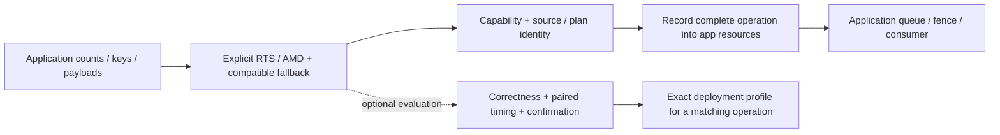

# HLSL Kernel Pipeline

**Reusable GPU primitives, trustworthy measurement, and explicit backend choice.**

This engine-neutral HLSL/D3D12 SDK builds complete scan and stable-sort operations
from application data. Applications can explicitly reuse pinned GPUPrefixSums RTS
and AMD Parallel Sort through the public API, with capability checks, source
identity and a declared fallback. The application owns resources and submission.

Measurements showed where my implementations lag mature libraries. The engineering
work is to expose those differences, account for the whole operation, and decide
which research candidates merit further optimization and which operations should
reuse an existing implementation. Internal algorithms remain research candidates;
the existing internal API defaults remain compatibility baselines, not measured
winners. Start with the [compilable CPU application example](examples/HlslPerf.PrimitiveApp/README.md).

## Results

**September 9 native GPU confirmation:** all 70 preregistered processes and
the independent GPU correctness gates passed. Tiled 4-bit sort took 12.124 ms
versus GPUSorting's FFX baseline at 15.038 ms on its original `2^25` pair workload
(paired baseline/candidate ratio 1.2404, 95% interval 1.2400–1.2408). The other
six comparisons favored RTS, DeviceRadixSort, OneSweep or FFX over the tested
candidate. Both 4/8-bit results, full costs and raw pairs are in the
[native confirmation report](docs/results/R9700_NATIVE_CONFIRMATION_2026-09-09.md).
These are exact native workload results, not SDK or Unity deployment profiles.
GPUSorting's vendored FFX is distinct from the SDK's FidelityFX SDK 1.1.4 adapter.
DeviceRadixSort and OneSweep are available in the native evaluation harness,
not through `PrimitiveOperations`. No automatic winner or default promotion follows.

**Current integration status (September 10):** RTS and AMD are existing explicit
SDK options; the new application example has CPU plan/selection checks and a
compiled borrowed-resource recording path. Its GPU execution and application
performance are unmeasured. The September 8 preparation reports describe their
own compile/CPU-only stage; they do not negate the September 9 GPU evidence.
Unity import, Player execution and an exact SDK/Unity deployment confirmation
remain separate work. The [wave-tiled scan/compaction](docs/integration/SCAN_WAVE_TILED.md)
and tiled stable-sort implementations remain explicit research candidates.

Historical September 7 evidence against an internal baseline:

- **1.4782x–1.5254x confirmed single-pass Scan speedup** at 16,777,216 elements,
  with one or three resident inputs, against the declared in-repository baseline.
- **19,584 output/poison checks passed** across the recorded 18-run formal matrix.

These are AMD Radeon AI PRO R9700 / D3D12 results from the September 7 paired
measurement protocol. [Exact controls and confidence intervals](docs/results/R9700_VNEXT_INTEGRATION_2026-09-07.md).

The separate historical external comparison found the internal single-pass
Scan took **2.21124× RTS time at 8 Mi elements**, and internal eight-bit sorting
took **2.41331× AMD Parallel Sort time at 1 Mi key/value pairs**. These ratios
favor the external libraries and belong to source
`824cfafc9a07ade0a3cf440c1f5b3a19af2e8bf0`; they do not measure this repair.
[Controls, failed/inconclusive cells and source identity](docs/integration/UNIFIED_BENCHMARK_RESULTS.md).



## Historical visual walkthrough

[](docs/portfolio/overview.png)

This unchanged figure shows September 7 single-pass Scan versus an internal
baseline. It does not summarize the seven September 9 external comparisons or
measure the current SDK example. [Current portfolio context and original sources](docs/portfolio/README.md).

## Engineering challenges

1. **Optimize the whole operation.** Scan, compaction and stable radix sorting
   need buffer management, barriers, scratch storage and output verification
   around the shader dispatches.
2. **Separate speedup from measurement noise.** Device state, input reuse and
   run order affect timings; selection needs fresh confirmation and drift checks.
3. **Choose what to reuse.** Preserve full-width input, stable payload ordering,
   source provenance and costs when integrating mature algorithms. A narrow
   experimental win does not establish a generally faster backend.

## My contribution

I implemented the primitive adapters and execution ABI, the D3D12 executor and
borrowed-resource recorder, paired calibration and confirmation, source-aware
caching, profile validation for Unity, and internal research kernels. RTS and
AMD shader algorithms are upstream implementations; DXC, Vortice and optional
AMD RGA supply compilation, API bindings and static analysis.

## Evidence and reproduction

[Latest measured results](docs/results/R9700_NATIVE_CONFIRMATION_2026-09-09.md) ·
[September 10 integration changes](docs/integration/POSITIONING_2026-09-10.md) ·
[Replay commands](docs/integration/REPLAY.md) · [SDK](docs/SDK.md) ·
[Visual showcases and experiment history](docs/EXPERIMENT_HISTORY.md) ·
[Quick start](#quick-start).

## Architecture and ownership boundary

    application input + explicit implementation + runtime identity
                               |
                               v
                 PrimitiveOperations / Select
                  complete operation + fallback
                               |
                               v
              application buffers + PSOs + state map
             t0/t1 + u0..u4 + b0[8] + ordered passes
                               |
                               v
                    D3D12OperationRecorder
                 copies / dispatches / barriers
                               |
                               v
             application queue / fence / output consumer

Offline evaluation is optional: workload plugins, CPU oracles, GPU verification,
paired timing and independent confirmation produce evidence for a specific
contract. The unified operation ABI and its deployment profile are separate from
the tuner's kernel ABI and Unity define-profile consumer; see the [SDK guide](docs/SDK.md).

The core and workload pack reference no Unity assemblies. The package under
`unity/com.edwinliu.hlslperf-profile` only validates and resolves an emitted
profile. Project code owns the final mapping from integer defines to its shader
variant system through `IHlslPerfDefineSink`.

## Research workload pack

- `reduction-u32-v1`: recursively reduces all input elements to one uint.
- `exclusive-scan-u32-v1`: compares hierarchical Blelloch, wave-hybrid, and
  persistent decoupled-look-back single-pass backends.
- `generic-exclusive-scan-u32-v1`: add/min/max/XOR with Wave32/64 and vector axes.
- `segmented-exclusive-scan-u32-v1`: pair-monoid segmented look-back scan.
- `stream-compaction-u32-v1`: unfused scan/scatter versus fused producer-consumer.
- `histogram-prefix-u32-v1`: global atomics versus replicated LDS plus offsets.
- `radix-sort-u32-v1`: stable 32-bit binary LSD sort using reusable scan scratch.
- `transpose-u32-v1`: padded groupshared 2D tiles with tunable tile dimension
  and block-row count.

Each provider builds the same public `KernelExecutionPlan` ABI, so a future
external workload package can supply buffers, constants, passes, dispatch
dimensions, and an oracle without changing the D3D12 backend.

## Quick start

The first-use path needs .NET 10 and the repository's existing dependencies;
it builds plans on the CPU and needs no GPU. Actual D3D12 recording/execution
requires a supported Windows device. Use a short Windows checkout path and
`git -c core.longpaths=true clone`.

From the repository root, with dependencies already cached (the supplied offline
configuration has no download sources):

```powershell
dotnet restore examples/HlslPerf.PrimitiveApp/HlslPerf.PrimitiveApp.csproj --configfile examples/HlslPerf.PrimitiveApp/NuGet.offline.config -p:NuGetAudit=false
dotnet build examples/HlslPerf.PrimitiveApp/HlslPerf.PrimitiveApp.csproj -c Release --no-restore
dotnet run --project examples/HlslPerf.PrimitiveApp -c Release --no-build --no-restore -- . --check
```

The example reports RTS/AMD selections, logical resources, complete pass stages
and CPU checks. It also compiles an application-owned recording/submission method
that `Main` never calls. See its [support, ownership and cost boundary](examples/HlslPerf.PrimitiveApp/README.md).

### Optional GPU evaluation

Tuning and diagnostics are ordinary explicit product commands; using them does
not require a conversation or chat authorization. They were not run in the
September 10 CPU integration work and are excluded from CPU CI. See
[external build/run entry points](benchmarks/external/README.md).
DynamicSmoke and GPU correctness runners are not CPU-only checks.

    dotnet build src/HlslPerf.Cli/HlslPerf.Cli.csproj -c Release
    dotnet run --project src/HlslPerf.Cli -c Release --no-build -- tune manifests/reduction.json
    dotnet run --project src/HlslPerf.Cli -c Release --no-build -- tune manifests/scan.json
    dotnet run --project src/HlslPerf.Cli -c Release --no-build -- tune manifests/scan-single-pass.json
    dotnet run --project src/HlslPerf.Cli -c Release --no-build -- tune manifests/scan-generic.json
    dotnet run --project src/HlslPerf.Cli -c Release --no-build -- tune manifests/segmented-scan.json
    dotnet run --project src/HlslPerf.Cli -c Release --no-build -- tune manifests/compaction.json
    dotnet run --project src/HlslPerf.Cli -c Release --no-build -- tune manifests/histogram-prefix.json
    dotnet run --project src/HlslPerf.Cli -c Release --no-build -- tune manifests/radix-sort.json
    dotnet run --project src/HlslPerf.Cli -c Release --no-build -- tune manifests/transpose.json
    dotnet run --project src/HlslPerf.Showcase -c Release
    dotnet run --project src/HlslPerf.Showcase -c Release --no-build -- --stress-grid --budget-ms 8.333333
    dotnet run --project src/HlslPerf.GpuDrivenDemo -c Release -- validate

The Crowd/VFX GPU matrix is intentionally a separate explicit action:

    dotnet run --project src/HlslPerf.GpuDrivenDemo -c Release --no-build -- run --level all --budget-ms 8.333333

RGA is optional and never redistributed. If its CLI is installed or unpacked,
attach live-driver evidence with:

    dotnet run --project src/HlslPerf.Cli -c Release --no-build -- tune manifests/scan.json --rga C:/tools/rga/rga.exe --rga-target gfx1201

Use `--rga off` to disable auto-discovery. Without RGA, correctness, timing,
selection, and profile emission still work.

Outputs go to `.hlslperf/runs/<timestamp>/`. GPU timing is never cached; only
DXIL compilation is cached by source/compiler/options/entry-point/define
identity. The profile compatibility key includes device, driver, backend,
shader model, compiler, manifest hash, and transitive kernel hash. After timing,
the runner poisons the verified resource and requires one already-used plan
invocation to reconstruct every byte before a profile can be emitted.

The standalone showcase under `showcase/` references the public execution ABI
and D3D12 backend, not Unity. Unity remains a read-only profile consumer.

<details>
<summary>Evaluation details, tradeoffs and supported scope</summary>

## Historical September 7 result and limits

The [September 7 vNext integration report](docs/results/R9700_VNEXT_INTEGRATION_2026-09-07.md)
retained all 18 runs and passed 19,584 output/poison checks. At 16M elements,
single-pass scan confirmed **1.4782x** and **1.5254x** speedups for one and three
resident slots. Wide-radix and dynamic-plan results did not establish deployable
gains, and no runtime defaults were promoted.

These are bounded AMD Radeon AI PRO R9700 / D3D12 measurements under the report's
declared controls, not universal gains or wins over every external library.
The separate [external comparison](docs/integration/UNIFIED_BENCHMARK_RESULTS.md)
retains inconclusive and semantically incompatible comparisons as well as wins.

The [dynamic ABI v2 demo](docs/DYNAMIC_EXECUTION.md) adds bounded GPU-count indirect dispatch and independent multi-output verification. Its correctness evidence is separate from historical performance results.

## Deliberate non-goals

- No Unity project or employer repository is required by the tuner.
- No replacement compiler, GPU API binding, ISA analyzer, or generic search
  framework is implemented here; DXC, Vortice, and optional RGA are reused.
- RGA static resource data does not replace measured GPU timestamps.
- Current RGA DX12 text output does not provide total theoretical occupancy.
  The profile keeps that field nullable instead of fabricating it from VGPRs;
  full occupancy evidence belongs to an RGP/runtime-counter adapter.
- Exhaustive enumeration is intentional for small candidate spaces. A search
  strategy adapter becomes useful only when a real workload exceeds that scale.

Read the [ABI contract](docs/ABI.md), [measurement methodology](docs/METHODOLOGY.md),
[RGA evidence policy](docs/RGA.md), [Unity consumer boundary](docs/UNITY_ADAPTER.md),
[SDK guide](docs/SDK.md), [roadmap](docs/ROADMAP.md), and
[clean-room provenance](docs/PROVENANCE.md).

</details>

## Provenance and license

Independent personal implementation; see [provenance](docs/PROVENANCE.md) for the source boundary.

## Benchmark reproduction permission

The [limited benchmark reproduction permission](LICENSE.md#limited-benchmark-reproduction-permission)
allows anyone to run the benchmarks and required project components, make local
changes needed for reproduction, and publish measurement results. Other plugin
rights remain reserved; this is not an MIT or general open-source license.
