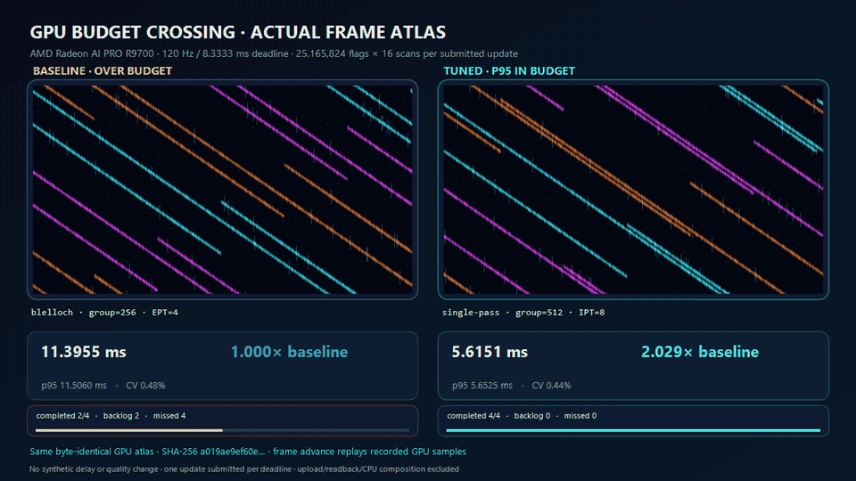
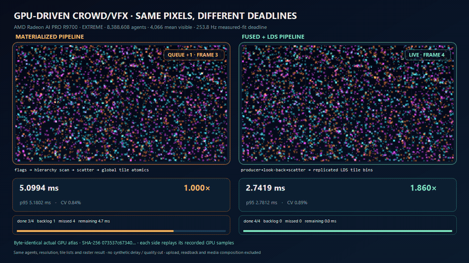

# Experiment history

These retained results use their original protocols. Later evidence does not retroactively change their baselines. See the [current project overview](../README.md).

## Five-process Scan applicability experiment

The [fixed 8 Mi Scan IO control](../docs/integration/CAUSAL_SCAN_RESULTS.md) changes
scalar IO to vector4 IO while retaining local scan and lookback work. The point
estimate improves, but all three comparisons fail the frozen variability gates.
This remains an opt-in diagnostic arm, with no default promotion or claim of
isolated hardware bandwidth improvement.

The [focused cost diagnosis](../docs/integration/FOCUSED_COST_RESULTS.md) examines
only 1 Mi key/payload Radix and 8 Mi Scan. A single opt-in ballot-rank candidate
reduces the Radix point estimate, but all four new comparisons remain inconclusive
under the frozen stability gates. Defaults are unchanged. The
[reproduction guide](../docs/integration/FOCUSED_COST_DIAGNOSTICS.md) separates
instrumented diagnostics, formal data and source-byte provenance.

The [official external comparison](../docs/integration/UNIFIED_BENCHMARK_RESULTS.md)
adds pinned AMD Parallel Sort and GPUPrefixSums implementations under one complete-operation
benchmark. All 120 fixed processes completed: four directional comparisons pass every
gate, 68 remain inconclusive, and 24 fallback comparisons are excluded for full32
semantic incompatibility. See the [reproduction protocol](../docs/integration/UNIFIED_BENCHMARK_PROTOCOL.md)
for source locks, independent-process statistics and retained failures. Defaults remain unchanged.

The [next-round Scan report](../docs/results/SCAN_PROCESS_BOUNDARY_2026-09-07.md)
covers 4/8/12/16 Mi uint elements with one/three resident inputs and five new
processes per cell. Four exact configurations passed all five process gates;
other cells remain inconclusive. No global crossover threshold or default
promotion is inferred.

The [conditional Radix report](../docs/results/RADIX_PROCESS_COMPARISON_2026-09-07.md)
retains all 80 fixed-control preflight processes across 16 cells. Ten cells
qualified for 50 new comparison processes; nine confirmed the fixed 8-bit
candidate at 1.3458x to 6.8791x against their declared 1-bit controls. One cell
retained mixed selections and six did not enter comparison. These are exact
configuration results, with complete-plan latency, memory and all failed gates
reported; no default policy was promoted.

## vNext paired measurement and dynamic plans

The [integrated vNext evidence](../docs/results/R9700_VNEXT_INTEGRATION_2026-09-07.md)
covers randomized paired calibration, independent confirmation, stable 4/8-bit
key/payload radix plans, bounded GPU-count indirect execution and real rotating
working sets. The bounded R9700 matrix retained all 18 runs and passed 19,584
output/poison checks. At 16M elements, single-pass scan confirmed 1.4782x and
1.5254x speedups for one and three resident slots. Wide radix and dynamic results
did not establish deployable gains; no defaults were promoted. See the
[replay instructions](../docs/integration/REPLAY.md) and exact scope in the report.
The older tables below remain historical measurements under their original protocols.

## v0.6 reusable SDK and fused primitive pack

The tuner is now an SDK rather than a repository-bound benchmark. External
assemblies can provide workloads through the public raw-buffer execution ABI;
`hlslperf new-workload` creates a separate package, schema 3.0 removes invalid
conditional products, checkpoints resume candidate by candidate, and transitive
`.hlsli` hashes invalidate stale DXIL and Unity profiles.

The new primitive pack adds generic and segmented scan, fused stream compaction,
histogram offsets, and stable 32-bit radix sort. Final R9700 runs using the
post-timing poison/re-execute gate produced 294/294 correct candidate outputs:

| Workload | Baseline median | Selected median | Selected p95 | vs baseline |
|---|---:|---:|---:|---:|
| Generic XOR scan, 4M | 0.05258 ms | 0.02773 ms | 0.02788 ms | 1.8963x |
| Segmented scan, 4M | 0.06989 ms | 0.04489 ms | 0.04525 ms | 1.5571x |
| Producer-scan-scatter compaction, 4M | 0.09433 ms | 0.01911 ms | 0.01931 ms | 4.9357x |
| Histogram + prefix offsets, 4M | 0.17234 ms | 0.01068 ms | 0.01081 ms | 16.1422x |
| 32-bit radix sort, 262K | 0.32861 ms | 0.25800 ms | 0.25980 ms | 1.2737x |

The compaction comparison times the full unfused producer -> materialized flags
-> scan -> scatter plan against a fused producer -> look-back -> direct scatter
plan. Its advantage is reduced end-to-end memory traffic, not an isolated scan
microbenchmark. See the [SDK guide](../docs/SDK.md), [primitive designs and evidence](../docs/V06_PRIMITIVES.md),
and [explicit v0.7 TODO](../docs/ROADMAP.md).

## v0.4 persistent single-pass and budget crossing

The new scan backend combines persistent logical-block claiming, wave-local
prefixes, and decoupled look-back. The image above is not a chart animation:
both sides use byte-identical GPU-generated frame atlases, while frame advance
replays the recorded per-plan GPU samples against a real 8.3333 ms deadline.
No delay or quality difference is synthesized.

At eight scans per plan, the selected backend pivots from Wave at 2M elements to
single-pass at 4M and then gains as the working set grows:

| Elements | Selected backend | Baseline median | Selected median | Selected p95 | vs baseline |
|---:|---|---:|---:|---:|---:|
| 2M | Wave, group 128, EPT 1 | 0.3515 ms | 0.2996 ms | 0.3031 ms | 1.1731x |
| 4M | Single-pass, group 512, IPT 8 | 0.5317 ms | 0.4413 ms | 0.4442 ms | 1.2047x |
| 8M | Single-pass, group 512, IPT 8 | 0.8929 ms | 0.7175 ms | 0.7218 ms | 1.2443x |
| 12M | Single-pass, group 512, IPT 8 | 2.1058 ms | 1.5257 ms | 1.5389 ms | 1.3802x |
| 16M | Single-pass, group 512, IPT 8 | 3.7291 ms | 1.9582 ms | 1.9625 ms | 1.9044x |
| 24M | Single-pass, group 512, IPT 8 | 5.7465 ms | 2.8541 ms | 2.8633 ms | 2.0134x |

The strongest validated 120 Hz crossing was 24M elements × 16 scans: baseline
11.3955 ms / p95 11.5060 ms versus single-pass 5.6151 ms / p95 5.6525 ms,
or 2.0294x. Across the 46-point stress grid, all 1,656 candidate outputs passed
the oracle and every baseline/selected pair passed the stability gate. The
standalone 4M scan also selected single-pass at 0.04316 ms, 1.2122x over its
declared baseline.

See the [single-pass design, full evidence, and limitations](../docs/results/R9700_SINGLE_PASS_2026-09-02.md).

## v0.3 actual-scene A/B showcase

This is the requested picture-level comparison, not a chart animation. Baseline
and tuned kernels separately generate the same 24-frame particle-field atlas on
the GPU. The runner captures their raw RGBA output, requires byte equality, and
then composes the two sequential captures with measured GPU timing.

| Pressure | Scan work per plan | Selected | Median | P95 | vs baseline |
|---|---:|---|---:|---:|---:|
| Low | 262K × 1 | retained baseline | 0.7266 ms | 0.7341 ms | 1.0000x |
| Medium | 1M × 2 | group 512, EPT 1 | 0.8521 ms | 0.8550 ms | 1.0180x |
| High | 4M × 4 | retained baseline | 1.4349 ms | 1.4408 ms | 1.0000x |
| Extreme | 16M × 8 | group 256, EPT 2 | 4.3552 ms | 4.3866 ms | 1.0341x |

All 48 candidates passed the GPU-output oracle and stability budget. Extreme
pressure produced the largest deployable end-to-end improvement; low and high
correctly retained the baseline under the 1.01x guard. See the
[full visual evidence and all four GIFs](../docs/results/R9700_VISUAL_SHOWCASE_2026-09-02.md).

## v0.2 result

All 37 candidates across full reduction, full exclusive scan, and tiled matrix
transpose passed byte-for-byte CPU oracles on an AMD Radeon AI PRO R9700. All 37
also met the stability budget and produced RGA 2.14.2 `gfx1201` evidence.

| Workload | Selected compile-time variant | Median | P95 | vs baseline |
|---|---|---:|---:|---:|
| 4M uint reduction | group 512, 8 items/thread | 0.011579 ms | 0.012037 ms | 1.1023x |
| 4M uint exclusive scan | group 128, 2 items/thread | 0.046190 ms | 0.046356 ms | 1.1186x |
| 2048x2048 uint transpose | tile 32, 8 block rows | 0.020756 ms | 0.020798 ms | 1.2493x |

These are cache-warm steady-state results for this GPU/driver/compiler and are
not universal parameter recommendations. See the [full R9700 v0.2 evidence](../docs/results/R9700_WORKLOAD_PACK_2026-09-01.md).

## v0.6 GPU-driven Crowd/VFX application proof

The new standalone `HlslPerf.GpuDriven` plugin turns the fused primitives into a
complete picture-producing application plan: moving-agent visibility, visible-
list compaction, screen-tile histogram and offsets, tile scatter, and a tiled
compute raster into a twelve-frame RGBA atlas. Its baseline materializes flags
and prefixes and uses global tile atomics; its optimized family fuses
producer -> scan -> scatter and merges replicated LDS histograms.

Two independent full matrices ran on an AMD Radeon AI PRO R9700. Each expanded
four pressure levels to 153 candidates; all 1,224 candidate executions across
both runs matched their CPU oracles. The primary guarded result was:

| Pressure | Agents | Baseline median | Selected median / p95 | Speedup |
|---|---:|---:|---:|---:|
| Low | 262K | 1.8799 ms | 1.7710 / 1.8566 ms | 1.0615× |
| Medium | 1M | 2.0461 ms | 1.7915 / 1.8095 ms | 1.1421× |
| High | 4M | 3.1800 ms | 2.2593 / 2.3098 ms | 1.4075× |
| Extreme | 8M | 5.0994 ms | 2.7419 / 2.7812 ms | 1.8598× |

The independent extreme replication measured 1.8689×. Reusing the primary
winner's exact configuration in the second already-recorded matrix measured
1.8480×, separating the architecture gain from near-tied parameter ordering.
The GIF/MP4 uses byte-identical actual GPU frames and a 253.8 Hz measured-fit
deadline because both paths were already below the requested 120 Hz budget.

The CPU-only validator remains available and does not create a D3D12 device:

    dotnet run --project src/HlslPerf.GpuDrivenDemo -c Release -- validate

GPU work still requires an explicit `run`. It produces a fresh pressure grid,
content-addressed atlases, and actual-frame deadline/backlog media; a
measured-fit deadline is labeled as such and is never presented as 120 Hz. See
the [design and evidence contract](../docs/GPU_DRIVEN_CROWD_VFX.md) and
[full R9700 evidence with raw samples](../docs/results/R9700_CROWD_VFX_2026-09-03.md).
