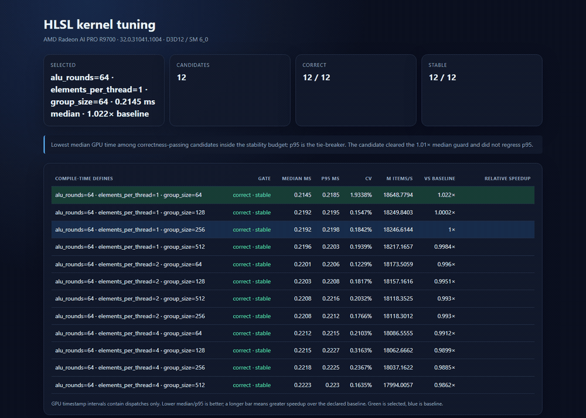

# R9700 v0.1 result

This is a pipeline validation result, not a claim that the synthetic parameter
choice transfers to another kernel.

[Static SVG version](r9700-final.svg)

## Environment

- Adapter: AMD Radeon AI PRO R9700 (VEN 1002, DEV 7551)
- Driver: 32.0.31041.1004
- Backend: D3D12 compute queue
- Shader model: 6.0
- Compiler binding: Vortice.Dxc 3.8.3
- OS build reported by .NET: Microsoft Windows 10.0.26200
- Manifest SHA-256: 1b96fe29cdfae99579fb2e285a2aee3bace160afc766c7f0133c2ff4a21f01cf
- Kernel SHA-256: 1409c11238b051b9f1d768a0adbb17df2b1dff3112d1c25d077d0b64de4f2e11

## Repeated calibrated runs

All three runs selected group size 64 with one element per thread. The declared
baseline was group size 256 with one element per thread.

| Run | Winner median | Winner p95 | Baseline median | Baseline p95 | Median speedup | Winner CV |
|---|---:|---:|---:|---:|---:|---:|
| calibrated | 0.214096 ms | 0.216604 ms | 0.217189 ms | 0.218050 ms | 1.01445x | 1.793% |
| repeat | 0.214039 ms | 0.217856 ms | 0.218485 ms | 0.219178 ms | 1.02077x | 1.897% |
| guarded final | 0.214491 ms | 0.218476 ms | 0.219219 ms | 0.219769 ms | 1.02204x | 1.934% |

In the guarded final run, all 12 candidates compiled, passed byte-for-byte
correctness, and met the 5% CV stability budget. Auto-calibration chose 64
dispatches per timestamp batch.

The 30-candidate boundary sweep measured a 1.0754x spread between its fastest
and slowest valid configurations. Its fastest observation improved on the
declared baseline by less than 1%, which is exactly the kind of run the
deployment guard is designed to leave at baseline.

## Reproduction

    dotnet run --project src/HlslPerf.Cli --no-build -- tune manifests/uint-mix.json --adapter R9700

Run from the repository root after a Release build. Results vary with clocks,
temperature, background GPU work, and driver state; compare the generated raw
samples rather than copying the rounded table.
