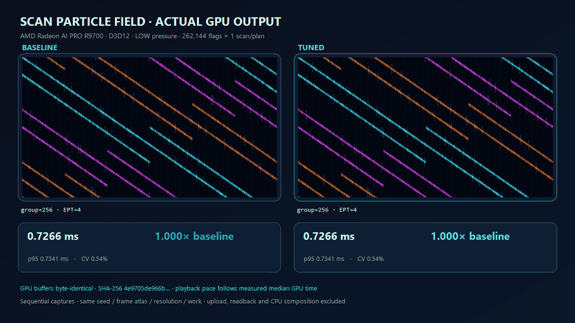
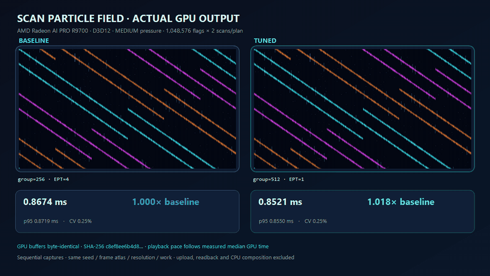
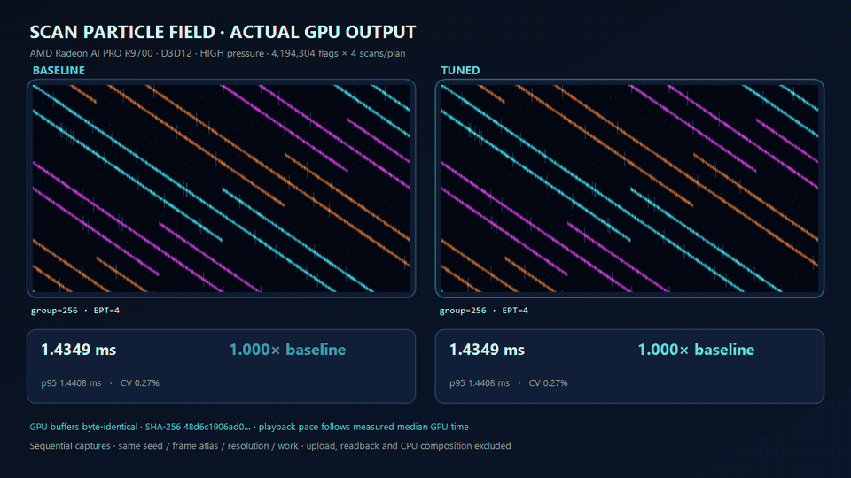
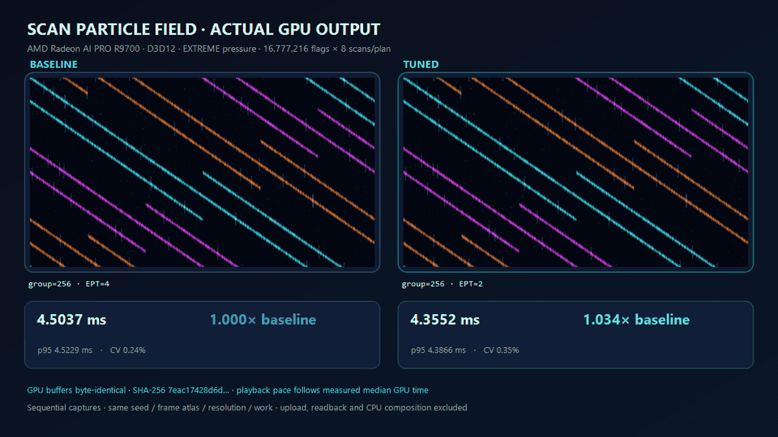

# R9700 actual-scene scan particle A/B

This result answers the visual question with picture-level output. Every panel
is composed from raw RGBA frame atlases captured from the R9700 after the GPU
executed a full global exclusive scan and a scan-driven particle visualizer.
It is not a chart rendered to look like a scene.

## Four pressure levels

### Low — baseline retained

### Medium — 1.0180x

### High — baseline retained

### Extreme — 1.0341x

[High-quality extreme-pressure MP4](r9700-scan-particles-extreme-ab.mp4)

## Guarded R9700 result

| Pressure | Flags × scans/plan | Correct/stable | Baseline | Selected | Median | P95 | CV | Speedup |
|---|---:|---:|---|---|---:|---:|---:|---:|
| Low | 262,144 × 1 | 12/12 | group 256, EPT 4 | baseline retained | 0.726643 ms | 0.734091 ms | 0.535% | 1.0000x |
| Medium | 1,048,576 × 2 | 12/12 | group 256, EPT 4 | group 512, EPT 1 | 0.852058 ms | 0.855002 ms | 0.254% | 1.0180x |
| High | 4,194,304 × 4 | 12/12 | group 256, EPT 4 | baseline retained | 1.434870 ms | 1.440802 ms | 0.268% | 1.0000x |
| Extreme | 16,777,216 × 8 | 12/12 | group 256, EPT 4 | group 256, EPT 2 | 4.355210 ms | 4.386641 ms | 0.346% | 1.0341x |

All 48 candidates produced byte-correct GPU images and met the 5% stability
budget. High pressure had a stable observed fastest candidate at 1.0053x, but
the deployment selector retained the baseline because it did not clear the
required 1.01x improvement. That prevents the visual demo from promoting noise
as an optimization.

Extreme pressure is the clearest end-to-end win in this matrix: median improves
from 4.503650 ms to 4.355210 ms and p95 improves from 4.522887 ms to 4.386641 ms.
The result is intentionally modest. Rendering the fixed 24-frame atlas is part
of every timed plan, so the number represents the complete reusable visual
pipeline rather than an isolated scan-only headline.

That distinction is material: the earlier isolated 4M scan workload reached
1.1186x on this machine, while the actual visual plan peaks at 1.0341x. The
showcase therefore exposes the whole-pipeline effect instead of implying that a
kernel-only percentage transfers unchanged to a rendered workload.

## Capture contract

- Baseline and tuned candidates run sequentially on the same device.
- Seed, flag data, resolution, frame count, and logical work are identical.
- GPU timestamps include all scan passes, required barriers, and the visualizer.
- Upload, readback, PNG/GIF/MP4 encoding, and CPU overlay work are excluded.
- The D3D12 runner captures the verified output buffer after measurement.
- Composition aborts unless baseline and tuned captured bytes are identical.
- GIF phase pacing follows the measured medians; no synthetic visual-quality
  difference is introduced.

Environment: AMD Radeon AI PRO R9700, driver 32.0.31041.1004, D3D12 compute,
shader model 6.0, Vortice.Dxc 3.8.3.0, Windows build 26200.

## Raw candidate samples

- [Low candidate CSV](data/r9700-scan-particles-low-candidates.csv)
- [Medium candidate CSV](data/r9700-scan-particles-medium-candidates.csv)
- [High candidate CSV](data/r9700-scan-particles-high-candidates.csv)
- [Extreme candidate CSV](data/r9700-scan-particles-extreme-candidates.csv)
- [Four-level summary CSV](data/r9700-scan-particles-stress-summary.csv)

## Reproduction identities

All four manifests use kernel SHA-256
`bbd5774d9632f5a97ef1729f41a6607e8f0e24557474d2c10f2cd5100a702c30`.

| Pressure | Manifest SHA-256 | GPU output SHA-256 |
|---|---|---|
| Low | `12b92f67da1c87dea555e76a430ec98e9f9db0ae09e2d23e7ab6ef9b0667372a` | `4e9705de966b4e35ff38acfac0c6f8314c187fc682cf7d936b2fd20a13d62f4d` |
| Medium | `757cfef134abf5235ecba3ce183f2869cf7460fed9572eeed1f738991781e4bf` | `c8ef8ee6b4d8d8a0291547d952fb10a93cedb3af3f932ea11c17128ca4a1e97a` |
| High | `42782f4c3413ec3917bf4f377b74921f0cb430f857487af860faace17fb97183` | `48d6c1906ad06f2de4fb61125605dcae70e96541d5b943cb14b78a74a05fb24e` |
| Extreme | `eb0488fca3a02933a3b80dd924c5cbe1b3aaed0a9ff0dce0184a54bd94d77aa4` | `7eac17428d6d0bd0f050ddf39de069e32cf2ed51479ecb06b4d340dc79766409` |
