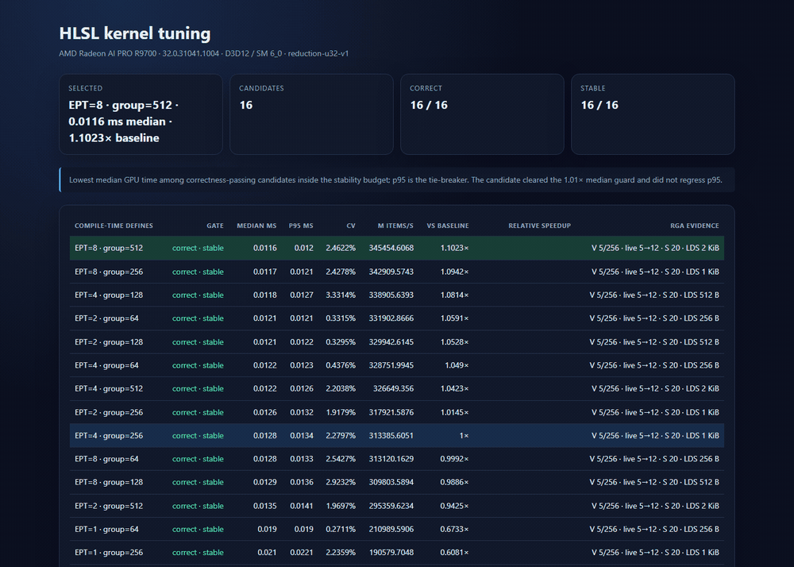
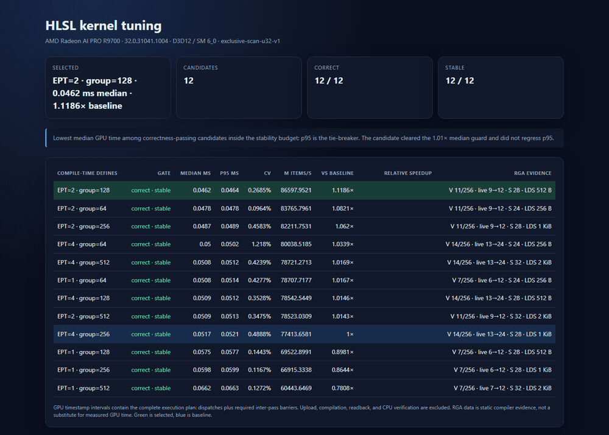
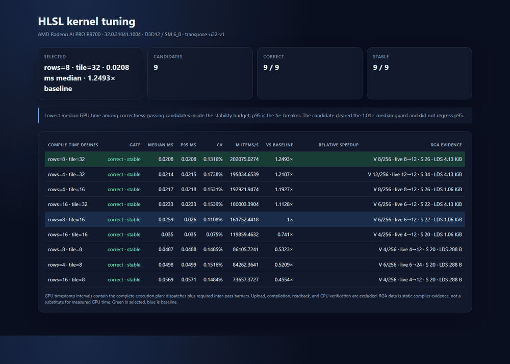

# R9700 v0.2 workload-pack result

This is device-specific steady-state evidence, not a claim that the selected
parameters transfer to another GPU, driver, compiler, or workload size.

Static SVGs: [reduction](r9700-v02-reduction.svg), [scan](r9700-v02-scan.svg),
[transpose](r9700-v02-transpose.svg).

## Environment

- Adapter: AMD Radeon AI PRO R9700 (VEN 1002, DEV 7551)
- Driver: 32.0.31041.1004
- Backend: D3D12 compute queue
- Shader model: 6.0
- DXC binding: Vortice.Dxc 3.8.3
- RGA: 2.14.2.7, DX12 live-driver target `gfx1201`
- Unity package validation: Unity 6000.5.3f1, 3/3 EditMode tests
- OS build reported by .NET: Microsoft Windows 10.0.26200

## Guarded final runs

| Workload | Candidates correct/stable/RGA | Selected | Median | P95 | CV | Baseline median | Speedup |
|---|---:|---|---:|---:|---:|---:|---:|
| 4,000,000 uint reduction | 16/16/16 | group 512, EPT 8 | 0.011579 ms | 0.012037 ms | 2.462% | 0.012764 ms | 1.1023x |
| 4,000,000 uint exclusive scan | 12/12/12 | group 128, EPT 2 | 0.046190 ms | 0.046356 ms | 0.268% | 0.051670 ms | 1.1186x |
| 2048x2048 uint transpose | 9/9/9 | tile 32, rows 8 | 0.020756 ms | 0.020798 ms | 0.132% | 0.025930 ms | 1.2493x |

All three winners cleared the 1.01x median guard without p95 regression. Batch
calibration reached 10 ms where needed: up to 1024 full plans for reduction,
256 for scan, and 512 for fast transpose candidates.

## Selected-candidate RGA evidence

| Workload/entry point | VGPR used | Max live | HW allocated | SGPR used | LDS | Scratch |
|---|---:|---:|---:|---:|---:|---:|
| reduction / `ReducePass` | 5 | 5 | 12 | 20 | 2048 B | 0 B |
| scan / `BlockScanPass` | 11 | 9 | 12 | 28 | 512 B | 0 B |
| scan / `AddScanOffsets` | 3 | 3 | 12 | 20 | 0 B | 0 B |
| transpose / `TransposePass` | 8 | 8 | 12 | 26 | 4224 B | 0 B |

RGA's current DX12 text output did not report overall occupancy, so the nullable
occupancy field is empty. No register-only approximation is presented as full
occupancy.

## Reproduction identities

| Workload | Manifest SHA-256 | Kernel SHA-256 |
|---|---|---|
| reduction | `c2056060d1d389c6f84bc2c00e45a2546c1670086c4ec72b58b27fa6587124d1` | `583dcec31966d946f990dd382935b7714302580d1469bc94227c976274af18b4` |
| scan | `154b6fe59b1b96543c6d6b019831e0bcba1a20f3f7105cabfaf89c3dc0b834d4` | `5f9bd14bc778be654a7fb9ee82385ad9225d43a1301fb0c0bf5ebc75894f498c` |
| transpose | `98c38acca3c34ac8284fcbea655331705377508c671616e45923dfe89061e109` | `c4cabe73680e0ada4ed9263fc3fa95180bae3a1c4e80f487e2ad1a11de9c8088` |

Run from the repository root after a Release build. Results vary with clocks,
temperature, cache state, background GPU work, and driver state; compare raw
samples from the generated `run.json`, not only rounded values.
