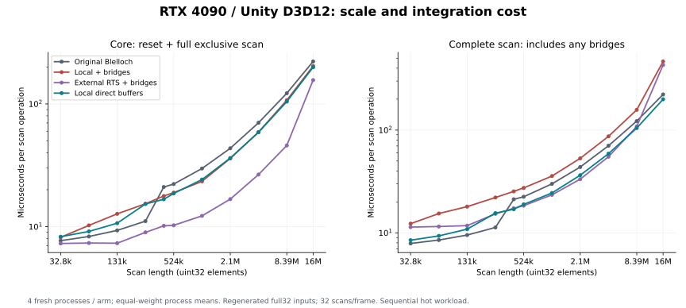
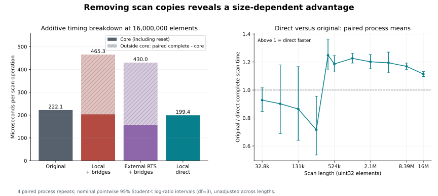
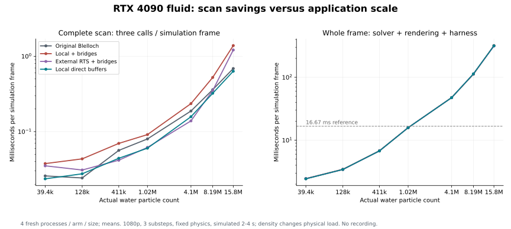
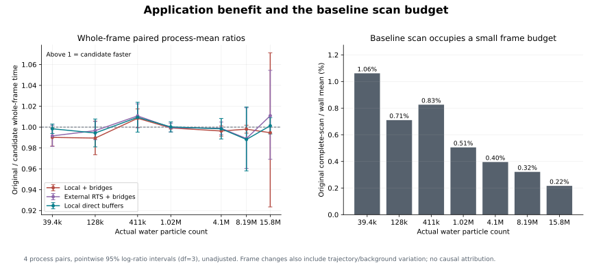

# Fluid exclusive-scan scale and integration diagnosis — RTX 4090, 2026-10-05

**Copies consumed a real scan advantage, but removing them did not establish a
material application acceleration.** The direct local path is faster than the
author's Blelloch scan at every tested isolated length from 410,758 through
16,000,000. At smaller tested lengths it does not establish an advantage. Pinned
external RTS remains faster in the **core scan** column at every tested length.
This is a workload-specific advantage over the original, not a universal local
algorithm advantage over mature libraries.

At 16,000,000 elements, original complete scan averages **0.222131 ms**, local
with bridges **0.465295 ms**, and local direct **0.199424 ms**. The adapted local
path spends **0.261719 ms outside its core range**. Direct removes scan pack/unpack
and cuts adapted complete time by about 57%; it takes about 10% less time than the
original. External RTS core averages **0.156451 ms**, below the direct local core
at **0.199236 ms**. All values below are equal-weight means of four independent
process means; p50/p95 remain available in the JSON and CSV evidence.

## Isolated scan: all measured lengths

Each cell is **core / complete GPU elapsed milliseconds per scan operation**.
Core includes required reset and the full algorithm, including recursive/multiple
dispatches. Complete includes any pack/unpack, padding and required dependencies.
This is a common instrumented command-stream boundary, not overhead-free kernel
busy time. These columns are nested and cannot be added.

| Elements | Original core / complete | Local core / complete | RTS core / complete | Direct core / complete |
| --- | --- | --- | --- | --- |
| 32,768 | 0.007688 / 0.007884 | 0.008186 / 0.012287 | 0.007292 / 0.011373 | 0.008278 / 0.008484 |
| 65,536 | 0.008313 / 0.008517 | 0.010240 / 0.015427 | 0.007355 / 0.011527 | 0.009143 / 0.009346 |
| 131,072 | 0.009318 / 0.009521 | 0.012716 / 0.018001 | 0.007328 / 0.011752 | 0.010667 / 0.010864 |
| 262,144 | 0.011088 / 0.011287 | 0.015369 / 0.022075 | 0.008979 / 0.015319 | 0.015300 / 0.015553 |
| 410,758 | 0.021029 / 0.021208 | 0.017758 / 0.025331 | 0.010156 / 0.017336 | 0.016716 / 0.016974 |
| 524,288 | 0.022239 / 0.022449 | 0.018935 / 0.027380 | 0.010254 / 0.018385 | 0.018645 / 0.018929 |
| 1,048,576 | 0.029774 / 0.029965 | 0.023391 / 0.035705 | 0.012241 / 0.023427 | 0.024207 / 0.024435 |
| 2,097,152 | 0.043512 / 0.043705 | 0.035943 / 0.053119 | 0.016754 / 0.033299 | 0.036210 / 0.036393 |
| 4,194,304 | 0.070241 / 0.070390 | 0.058992 / 0.086887 | 0.026587 / 0.055055 | 0.058760 / 0.058922 |
| 8,388,608 | 0.122254 / 0.122404 | 0.107253 / 0.157490 | 0.045863 / 0.108487 | 0.104539 / 0.104732 |
| 16,000,000 | 0.221932 / 0.222131 | 0.203575 / 0.465295 | 0.156451 / 0.430025 | 0.199236 / 0.199424 |

The paired process-mean direct/original complete-scan ratios have nominal
pointwise 95% intervals above 1 at all seven tested lengths from 410,758 upward.
Their mean time reduction is approximately 10–20% relative to original. The
262,144 point favors original, and the smaller points do not establish a direct
win. The exact crossover between 262,144 and 410,758 is unmeasured.

The source records three original scan dispatches up to 262,144 elements and
five above that threshold in this sweep; direct uses reset plus the persistent
scan. This is a source-level explanation consistent with the crossover, rather
than counter-based proof of the dominant cost. No new DRAM/cache/occupancy counters
were collected. RTS's smaller core time remains evidence against claiming that
the local exclusive algorithm is best in this regime.

For additive attribution, outside-core time is computed per source frame as
`complete - core`, then averaged. Independent medians can be non-additive,
especially with bimodal small timings; subtracting median complete and median
core is not used to infer copy time.

## Application: all measured particle counts

GPU scan values accumulate **three calls per simulation frame**, while whole-frame
values are wall milliseconds including solver, rendering, presentation and harness.
They are not the units of the per-operation sweep table. Each size uses identical
scene/camera/quality/physics parameters across all four arms.

| Particles | Original core / complete | Local core / complete | RTS core / complete | Direct core / complete |
| --- | --- | --- | --- | --- |
| 39,366 | 0.025346 / 0.025807 | 0.023616 / 0.037626 | 0.022153 / 0.035127 | 0.023196 / 0.023605 |
| 128,000 | 0.023808 / 0.024241 | 0.029527 / 0.043471 | 0.019311 / 0.030901 | 0.027095 / 0.027526 |
| 410,758 | 0.055891 / 0.056322 | 0.046368 / 0.069750 | 0.022541 / 0.041713 | 0.043791 / 0.044254 |
| 1,024,000 | 0.079499 / 0.079940 | 0.059541 / 0.091281 | 0.034419 / 0.061673 | 0.059821 / 0.060235 |
| 4,096,766 | 0.187243 / 0.187703 | 0.160258 / 0.235273 | 0.068971 / 0.138758 | 0.157152 / 0.157606 |
| 8,192,000 | 0.359667 / 0.360119 | 0.303445 / 0.523821 | 0.114980 / 0.351665 | 0.322385 / 0.322831 |
| 15,761,198 | 0.686803 / 0.687543 | 0.644567 / 1.386573 | 0.467802 / 1.211622 | 0.632612 / 0.633139 |

| Particles | Original whole frame | Local adapted whole frame | RTS adapted whole frame | Local direct whole frame |
| --- | --- | --- | --- | --- |
| 39,366 | 2.432 | 2.456 | 2.452 | 2.436 |
| 128,000 | 3.414 | 3.451 | 3.426 | 3.434 |
| 410,758 | 6.821 | 6.764 | 6.749 | 6.757 |
| 1,024,000 | 15.823 | 15.835 | 15.830 | 15.820 |
| 4,096,766 | 47.508 | 47.686 | 47.565 | 47.585 |
| 8,192,000 | 112.107 | 112.330 | 113.367 | 113.469 |
| 15,761,198 | 317.939 | 319.695 | 314.431 | 317.509 |

| Particles | Original/direct whole-frame ratio | Pointwise 95% interval | Original scan / wall mean |
| --- | --- | --- | --- |
| 39,366 | 0.9984 | 0.9939–1.0029 | 1.061% |
| 128,000 | 0.9944 | 0.9811–1.0078 | 0.710% |
| 410,758 | 1.0094 | 0.9952–1.0238 | 0.826% |
| 1,024,000 | 1.0002 | 0.9954–1.0050 | 0.505% |
| 4,096,766 | 0.9984 | 0.9885–1.0083 | 0.395% |
| 8,192,000 | 0.9882 | 0.9581–1.0192 | 0.321% |
| 15,761,198 | 1.0013 | 0.9935–1.0091 | 0.216% |

No tested particle count has a direct/original whole-frame pointwise interval entirely above 1.
Original scan occupies only **0.22–1.06%** of the measured original wall
frame. The direct scan savings are a smaller fraction still. GPU simulation and
wall time change by several percent in some independent runs while scan timing
stays close; all these runs are retained. Atomic equal-key ordering can change
trajectories, and desktop background work was not isolated. Whole-frame differences
therefore do not provide causal attribution to scan alone. There is no established
visibly richer-water, sustained 60 FPS, or higher-particle-capacity result.

The 15,761,198-particle workload executes with finite final positions, but its
whole frame is over 300 ms. Increasing particle density with fixed smoothing
radius and physics increases neighbor/solver load and changes the physical
discretization. This sweep is a workload diagnostic, not a constant-physics-quality
capacity experiment. No interpolation is used to claim a maximum particle count.

## Compatible-buffer implementation

The new `hlsl-wave-tiled-direct` arm changes histogram counts to raw uint32 storage.
The producer writes that buffer directly. The scan borrows it read-only and returns
a **distinct raw prefix buffer**; atomic scatter consumes that result directly.
Both full-array scan bridges are removed. The author's sorted key/item copyback
remains in complete-sort timing. Direct output never aliases input, and the same
counting-sort operations and unstable equal-key semantics are retained.

RTS retains its structured/uint4 bridge path. Direct local versus adapted RTS
complete time compares different integration costs; the separately reported core
column prevents confusing this with a better underlying algorithm. An RTS direct
consumer was not implemented or measured in this cohort.

## Execution and validation

- RTX 4090 24 GB, Core Ultra 7 265K, 32 GB RAM, Windows 11 build 26200; NVIDIA 617.14.
- One Unity 6000.3.13f1 x64 Development Player, D3D12, Graphics Jobs disabled.
- Formal sweep: 16 fresh processes; four cyclic arm orders, four balanced length
  orders, 11 lengths/process, 60 warmup and 120 measured frames/length, 32 regenerated
  scans/frame. **21,120 accepted source-frame rows / 675,840 measured scan operations**.
- Pattern `uint32(index * 747796405 + 2891336453)` is regenerated before every
  operation outside complete/core ranges. Full-size output and guards are checked
  before and after timing at each length; direct input is also checked unchanged.
  This is a sequential hot workload, not a cold-cache throughput experiment.
- Formal application: **112 fresh processes**, seven actual counts, four arms,
  four cyclic arm orders. 120 warmup + 120 measured fixed steps (simulated 2–4 s),
  1920×1080, seed 42, dt 0.01666666753590107, three substeps, author's water/foam scene,
  foam capacity 1,024,000. **13,440 wall / 67,200 GPU metric observations**.
- Every process passes 80 full-output scan, 18 complete sort/permutation and
  18 spatial-offset cases before measurement. All four independent gate processes
  pass. Every application process checks all final position coordinates for finite
  values after timing stops and sample collection drains. Finite execution does not
  assert numerical trajectory or image equivalence across arms.
- Native `/W4 /WX`, 34 generated C# sources, 36 compute entries and 25 CPU settings
  cases pass. Nine existing harness, four sweep-integrity, four application-integrity
  tests and 12 CPU wave-model tests pass. Unity import/Player build and actual GPU
  execution are separately evidenced; offline compilation is not their substitute.

Native queries run on Unity's active graphics command list, use its timestamp
frequency and read only after the corresponding Unity frame fence completes.
There is no extra queue submission, flush or blocking timing readback. Only
initialized query ranges are resolved. Five GPU metrics require 26 timestamps per
application frame; the sweep enables two 32-call ranges plus one batch range.
Every accepted observation belongs to its declared source-frame window and every
per-frame nesting relation validates. Allocation/readback belong to startup or
post-timing validation. No video recording, simultaneous arms, profiling captures
or hidden-backbuffer performance runs enter these cohorts.

Statistics equally weight four process means and pair repeat IDs for log ratios.
Student-t intervals use df=3; they are nominal pointwise 95%, unadjusted across
lengths/metrics, rather than simultaneous confidence bands. Four pairs have limited
power for tiny application changes. All processes and frames are retained; no
outlier filter or selection based on speed is applied.

## Invalid attempt retained

The first sweep passed numerical checks but discovered an adapter defect: RTS
scanned the old allocation capacity after a smaller logical length was requested.
This inflated shorter-length timings without changing their valid prefixes.
All 16 processes are retained under `invalid/sweep-01`, with an explicit
`invalid-attempt.json` marker that the analyzer rejects. The fix keeps capacity
for reuse while dispatching the current padded logical length. The second,
fully repeated cohort is the accepted one. The earlier fixed-size fluid result
is unaffected; its source/cohort and videos remain historical and are not mixed
with this new instrumentation or direct path.

## Frozen identities and reproduction

- Measured payload: `2e71b144164b5b805a8803f04733ca1a57446752af0ed2c33278d4343788d6da`.
- Base HLSL commit: `1564590b1b1bf703ac659ad2706d74e2bc305421` plus explicitly dirty overlay bytes.
- Player SHA-256: `47b23bfad0dbb1200a41daae299396c49924b87c0222e2e4258687a3505334a0`.
- Native source: `751f84458d7ab96d4d74b07b4e9fc1006c05a95b3f32dbb2b985e71ee9b26c3b`.
- Native DLL: `791de4be9086256bd1bb22341284973b5d4d6c808a5a8cdc5211e339fc2380d9`.
- Fluid-Sim MIT pin: `4717b7259718d349b0001c82836f24ce5fec81d7`.
- GPUPrefixSums MIT pin: `98d93a4e9ed2f3c8353119515bf9be90a2e137ad`; all five vendor files unchanged.
- [Accepted scan cohort](data/fluid-scan-scaling-20261005/sweep-cohort.json),
  [application cohort](data/fluid-scan-scaling-20261005/application-cohort.json),
  [CSV curves](data/fluid-scan-scaling-20261005/scan-scaling.csv),
  [application CSV](data/fluid-scan-scaling-20261005/application-scaling.csv).
- [Complete accepted/invalid/pilot evidence](../evidence/fluid-scan-scaling-20261005.zip).
- [Source, build, launch and analysis instructions](../../unity/FluidScanBenchmark/README.md).

The evidence archive includes plans, process exits, source identities, correctness,
unaltered observation CSVs, summaries and original/public byte inventories. JSON
output-directory and local command paths are redacted; raw private licensing logs
remain local and are represented by hashes and a build closeout receipt. Both
cohorts recompute exactly from the public copies. Completion checks all Player file
hashes against the pre-execution plans. Source regeneration matches every measured
runtime/kernel/input/DLL byte; only the guide differs. The local source deliverable
includes exact tested editor Packages/ProjectSettings and all reproduction tools.

**Decision:** retain direct buffers as a validated experimental integration option;
keep the original default and the negative application conclusion. This gives a
measured comfort region against the author baseline and identifies integration
cost, while leaving the mature-library core gap and dominant solver/render cost
visible. No new comparison video is produced from these performance runs.
